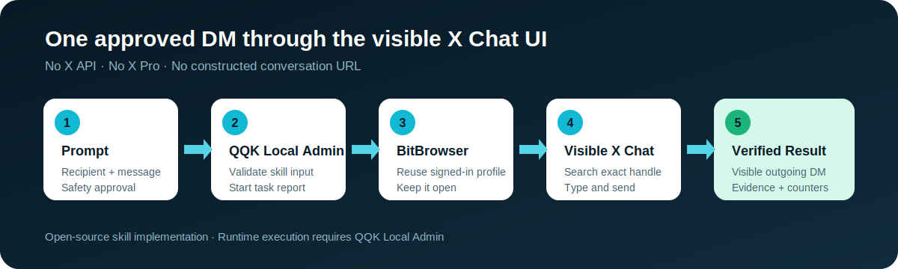

# QQK X Web Send DM Outreach

Open-source skill entry for sending one direct message through the visible X.com Chat interface with QQK.

[中文说明](#中文说明)

## What it does

- Opens the normal X Chat page without using the X API or X Pro.
- Searches for an exact `@handle` through the visible **New message** interface.
- Types the message with keyboard events instead of pasting it.
- Sends only when QQK Safety Rehearsal is off and the operator approves the real run.
- Verifies the outgoing message in the page and writes the result to a QQK task report.
- Keeps the selected BitBrowser profile open by default.

## Requirements

- A free [QQK account](https://www.qqk.ai/?utm_source=github&utm_medium=repository&utm_campaign=x_web_send_dm_outreach)
- QQK Local Admin
- BitBrowser
- A BitBrowser profile already signed in to X.com

## How to use

1. Install and sign in to QQK Local Admin.
2. Sync and enable **X Web Send DM Outreach / X网页私信触达** in **Skill List**.
3. Open **AI Assistant**.
4. Turn on **Safety Rehearsal** for a preview, or turn it off and approve the task for a real send.
5. Use a prompt like:

```text
Use BitBrowser profile general-us-1 to open X Chat, click New message,
search @example_user, click the exact result, and send this message:
Hi, I enjoyed your recent posts about browser automation.
Do not construct a conversation URL. Keep the profile open when finished.
```

QQK supplies `dryRun` from the Safety Rehearsal switch. You do not need to add `send`, `publish`, or `confirmRealRun`.

## Repository scope

This repository intentionally contains only:

- the skill entry module;
- the public skill contract;
- English and Chinese invocation templates;
- this usage guide and the license.

It is not a standalone browser-automation package. QQK Local Admin supplies the shared browser runtime, CDP connection, resource coordination, approval flow, and task reporting used by the entry module. This keeps the public repository focused on the skill while avoiding duplicated client runtime files.

The individual skill can be inspected and used through QQK Local Admin. QQK's broader multi-account control, cloud control, fingerprint-browser management, and additional skill catalog are separate product capabilities.

## Responsible use

Only contact people you are authorized to message. Follow X rules and applicable anti-spam, privacy, and marketing laws. Keep outreach relevant and respect opt-outs.

## License

MIT. See [LICENSE](LICENSE).

---

## 中文说明

这是 **X Web Send DM Outreach / X网页私信触达** 的开源技能入口。它通过 QQK 操作 X.com 可见的聊天页面，不使用 X API，也不依赖 X Pro。

### 功能

- 从 X Chat 的“新消息”界面搜索准确的 `@用户名`；
- 点击准确用户结果，不拼接私信会话 URL；
- 通过键盘事件模拟人工输入，而不是粘贴；
- “安全演练”开启时只预演，关闭并经用户批准后才真实发送；
- 在页面中验证消息并将业务结果写入 QQK 任务报告；
- 任务结束默认保持 BitBrowser Profile 打开。

### 使用条件

- 免费注册 [QQK 账号](https://www.qqk.ai/?utm_source=github&utm_medium=repository&utm_campaign=x_web_send_dm_outreach)
- 安装并登录 QQK Local Admin
- 安装 BitBrowser
- 已有一个登录 X.com 的 BitBrowser Profile

### 使用方法

1. 在 QQK Local Admin 的“技能列表”同步并启用 **X Web Send DM Outreach / X网页私信触达**。
2. 打开“AI 助手”。
3. 预演时打开“安全演练”；真实发送时关闭该开关并批准任务。
4. 使用下面的提示词：

```text
请使用 BitBrowser profile general-us-1 打开 X Chat，点击新消息，
在搜索框逐字输入 @example_user，点击准确用户结果并发送：
你好，我看了你最近分享的浏览器自动化内容，很有启发。
不要拼接会话 URL，任务结束保持浏览器打开。
```

`dryRun` 由 AI 助手的“安全演练”开关统一控制，不需要传入 `send`、`publish` 或 `confirmRealRun`。

### 为什么仓库不包含运行时依赖

这个仓库只用于公开技能入口代码、技能契约和使用说明，并不是独立客户端。CDP 通道、X 网页公共运行时、资源协调、安全确认和任务报告都由 QQK Local Admin 提供，因此无需在每个开源技能仓库中重复复制。

请只向允许联系的用户发送相关消息，遵守 X 平台规则以及适用的反垃圾、隐私和营销法规。
# QQK X Web Send DM Outreach

[简体中文](README.zh-CN.md)


Open-source X DM outreach automation for QQK. This browser skill opens the normal X Chat interface, searches an exact user, types one direct message through keyboard events, sends only after explicit operator approval, and verifies the visible result in a QQK task report.

It does **not** use the X API, require X Pro, or construct a private conversation URL.



## What It Does

- Opens X Chat through the visible website UI.
- Clicks the visible **New message** or **New chat** control.
- Types an exact `@handle` into the visible recipient search.
- Requires and clicks the exact matching user result.
- Types the requested message with keyboard events instead of pasting it.
- Sends only when QQK Safety Rehearsal is off and the operator approves the real run.
- Detects duplicate visible messages before sending.
- Handles the X **Unlock more on X** dialog by clicking **Got it** and resuming.
- Verifies the outgoing message and records conservative task-report results.
- Keeps the selected BitBrowser profile open by default.

This repository is intended for developers who want to inspect the implementation and for QQK users who want a ready-to-use X browser automation skill.

## Quick Start

### Requirements

- A [QQK account](https://www.qqk.ai/?utm_source=github&utm_medium=repository&utm_campaign=x_web_send_dm_outreach) with free registration
- QQK Local Admin installed and running
- BitBrowser installed
- A BitBrowser profile already signed in to X

### Run from QQK Local Admin

1. Sign in to QQK and install Local Admin.
2. Open **Skill List** and sync or enable **X Web Send DM Outreach / X网页私信触达**.
3. Open the BitBrowser profile that is signed in to X.
4. Open **AI Assistant** in Local Admin.
5. Keep **Safety Rehearsal** on for a preview, or turn it off and approve the task for a real send.
6. Use a prompt like this:

```text
Use BitBrowser profile demo-us-1 to open X Chat, click New message,
search @example_user, click the exact result, and send this message:
Hi! I enjoyed your recent posts about browser automation.
Do not construct a conversation URL. Keep the profile open when finished.
```

QQK supplies `dryRun` from the Safety Rehearsal switch. Do not add `send`, `publish`, or `confirmRealRun` to the skill input.

More examples are available in [examples/prompts.md](examples/prompts.md).

## Preview and Real Send

| Safety Rehearsal | Behavior |
| --- | --- |
| On | Opens the real conversation, types the message, captures evidence, and does not click Send. |
| Off | Requires explicit approval, clicks Send, and reports success only after the outgoing message is visibly verified. |

The skill never treats a click alone as successful delivery.

## Task Report

A successful task report exposes business-oriented results such as:

- `businessStatus`
- `recipientHandle`
- `recipientsProcessed`
- `messagesAttempted`
- `messagesSucceeded`
- `sent`
- `alreadySent`
- `messageId`
- `conversationUrl`
- `screenshotPath`
- `closedProfile`

See the fully synthetic [sample task report](examples/task-report.sample.json). Do not publish real customer conversations or unredacted screenshots in GitHub issues.

## Source Layout

```text
.
├── skill/
│   ├── modules/
│   │   ├── cdp-session.mjs
│   │   ├── send-direct-message.mjs
│   │   ├── send-dm-outreach.mjs
│   │   └── x-web-skill-runtime.mjs
│   ├── config.json
│   └── qqk-skill.json
├── docs/
│   ├── ARCHITECTURE.md
│   ├── INSTALLATION.md
│   ├── RESPONSIBLE_USE.md
│   ├── SKILL_REFERENCE.md
│   └── TROUBLESHOOTING.md
├── examples/
│   ├── prompts.md
│   └── task-report.sample.json
└── tools/
    └── validate-repository.mjs
```

The JavaScript modules contain the browser behavior. The declarative single-step QQK workflow is represented in `skill/qqk-skill.json` and is stored by QQK Local Admin in its workflow database after publication or catalog sync. AI Assistant multi-skill plans are separate runtime database records and are not embedded in these modules.

Read [Architecture](docs/ARCHITECTURE.md) for the exact boundary.

## Source Availability and Runtime Boundary

The source code in this repository is available under the MIT License. Running the skill through the supported product flow requires QQK Local Admin and its browser, approval, task-report, and skill-registry services.

The included manifest is a transparent, reviewable representation of the published skill contract. The current QQK user flow installs the released version from the QQK skill catalog; the manifest is not presented as a standalone double-click installer.

## Responsible Use

Use this skill only for accounts you control and messages you are authorized to send. Do not use it for spam, harassment, impersonation, deceptive outreach, or unsolicited bulk messaging. You are responsible for complying with X rules and applicable laws.

Read [Responsible Use](docs/RESPONSIBLE_USE.md) and [Security Policy](SECURITY.md) before running a real send.

## Development

Node.js 22 or later is recommended for repository validation:

```bash
npm test
```

The validation command checks JavaScript syntax, JSON structure, required artifacts, accidental absolute local paths, and common secret markers. It does not send a message or open a browser.

Contributions are welcome through focused issues and pull requests. See [CONTRIBUTING.md](CONTRIBUTING.md).

## License and Disclaimer

MIT License. See [LICENSE](LICENSE).

This project is not affiliated with, endorsed by, or sponsored by X Corp. X and related marks belong to their respective owners. QQK is responsible only for the QQK software and documentation distributed by QQK.
